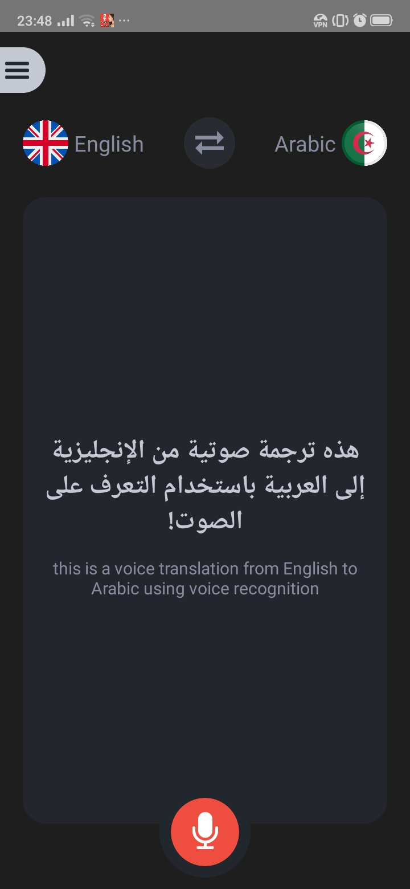
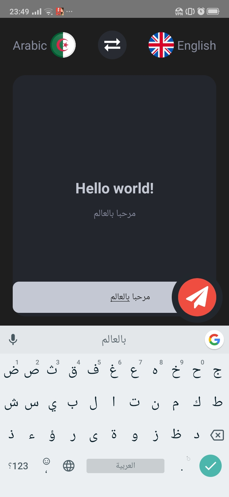
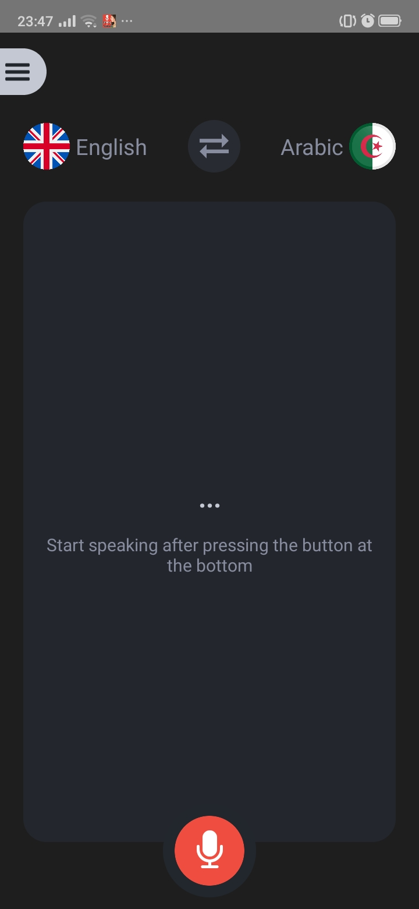
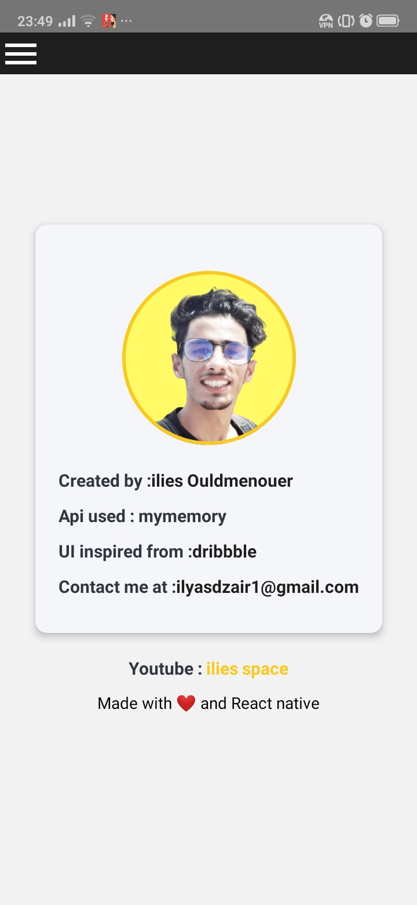

 <h2>voice language Translator</h2>
 

  
ARAB to ENGLISH / ENGLISH to ARAB voice translation using  <a href= 'https://mymemory.translated.net/doc/spec.php' >mymemory translator API</a> and 
  <a href 'https://github.com/react-native-community/voice'>react-native-community/voice : A speech-to-text library for React Native.</a>

 

 
 

 
 
APK signed file of the project availaible <a href ='https://github.com/ilies-space/voiceTranslator-reactNative/blob/master/APK/Voice%20translator%20MVP.apk' >HERE</a>  

 

UI Preview                 |  UI Preview
:-------------------------:|:-------------------------:
  |  
  |  

Made with ❤ in Algeria 
by : <a href= 'https://www.instagram.com/ilies_ouldmenouer/' >ilies Ouldmenouer</a> 
